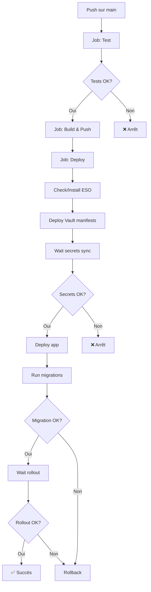

# GitHub Actions Workflows

Ce projet utilise plusieurs workflows GitHub Actions pour automatiser le déploiement et la gestion de l'infrastructure.

## 📋 Workflows disponibles

### 1. 🚀 Deploy (Automatique)
**Fichier**: `.github/workflows/deploy.yml`  
**Déclencheur**: Push sur `main`

Pipeline de déploiement automatique complète :

1. **Tests** (`php artisan test`)
2. **Build & Push** Docker image vers GHCR
3. **Deploy**:
   - Installation/vérification External Secrets Operator
   - Déploiement manifestes Vault
   - Synchronisation secrets depuis Vault
   - Déploiement application
   - Migrations base de données
   - Rollback automatique en cas d'erreur

**Usage**:
```bash
git add .
git commit -m "feat: nouvelle fonctionnalité"
git push origin main
```

---

### 2. 🎯 Deploy Manual (Manuel)
**Fichier**: `.github/workflows/deploy-manual.yml`  
**Déclencheur**: Manuel via GitHub UI

Déploiement manuel avec option pour skip les tests.

**Usage**:
1. Aller sur GitHub : **Actions → Deploy to Production**
2. Cliquer **Run workflow**
3. Choisir si skip tests (pas recommandé)
4. Cliquer **Run workflow**

**Cas d'usage**:
- Redéploiement après maintenance
- Déploiement d'urgence (hotfix)
- Tests de la pipeline

---

### 3. 🔧 Vault Operations (Manuel)
**Fichier**: `.github/workflows/vault-ops.yml`  
**Déclencheur**: Manuel via GitHub UI

Opérations de gestion Vault sans redéployer l'app.

**Opérations disponibles**:

| Operation | Description |
|-----------|-------------|
| `check-status` | Vérifier le statut de Vault, ESO et secrets |
| `unseal` | Instructions pour unseal Vault |
| `sync-secrets` | Forcer la synchronisation des secrets |
| `view-externalsecret` | Voir les détails de l'ExternalSecret |

**Usage**:
1. Aller sur GitHub : **Actions → Vault Operations**
2. Cliquer **Run workflow**
3. Sélectionner l'opération
4. Cliquer **Run workflow**

**Exemple - Forcer sync après changement secret**:
```bash
# 1. Mettre à jour secret dans Vault
vault kv patch secret/cinegest/app DB_PASSWORD="new_pass"

# 2. Via GitHub Actions
Actions → Vault Operations → sync-secrets

# 3. Redémarrer l'app
kubectl -n cinegest rollout restart deployment/cinegest-back
```

---

## 🔐 Secrets GitHub requis

Configurer dans : **Settings → Secrets and variables → Actions**

### Obligatoires

| Secret | Description | Comment obtenir |
|--------|-------------|-----------------|
| `KUBECONFIG_B64` | Kubeconfig encodé base64 | `cat ~/.kube/config \| base64 -w0` |

### Optionnels

| Secret | Description | Usage |
|--------|-------------|-------|
| `VAULT_TOKEN` | Token root Vault | Pour automation updates secrets |
| `VAULT_ADDR` | URL Vault custom | Si différent du défaut |

---

## 🔄 Workflow de déploiement

### Configuration initiale (une seule fois)

```bash
# 1. Installer Vault sur le cluster
./k8s/vault/install.sh

# 2. Initialiser et configurer Vault
# (voir k8s/vault/README.md)

# 3. Configurer GitHub Secret KUBECONFIG_B64
cat ~/.kube/config | base64 -w0
# → Copier dans GitHub Settings → Secrets

# 4. Push code
git push origin main
# → Pipeline se déclenche automatiquement
```

### Déploiement continu



---

## 📊 Monitoring des déploiements

### Via GitHub Actions UI

1. **Actions** tab
2. Sélectionner le workflow
3. Voir les logs en temps réel

### Via kubectl

```bash
# Status du déploiement
kubectl -n cinegest rollout status deployment/cinegest-back

# Logs en temps réel
kubectl -n cinegest logs -f deployment/cinegest-back

# Logs de migration
kubectl -n cinegest logs job/cinegest-back-migrate

# Status ExternalSecret
kubectl -n cinegest get externalsecret cinegest-back-vault
```

---

## 🆘 Troubleshooting

### Pipeline échoue : "Timeout waiting for Vault secrets"

**Cause**: Vault sealed ou non configuré

**Solution**:
```bash
# Vérifier Vault
kubectl -n vault exec deploy/vault -- vault status

# Unseal si nécessaire
kubectl -n vault exec -it deploy/vault -- sh
export VAULT_ADDR=http://localhost:8200
vault operator unseal <UNSEAL_KEY>
```

Puis relancer via **Vault Operations → sync-secrets**

---

### Pipeline échoue : "Migration failed"

**Cause**: Erreur SQL ou timeout

**Solution**:
```bash
# Voir les logs de migration
kubectl -n cinegest logs job/cinegest-back-migrate

# Si nécessaire, rollback manuel
kubectl -n cinegest rollout undo deployment/cinegest-back
```

---

### Redéployer après un échec

**Option 1 - Re-trigger automatique**:
```bash
git commit --allow-empty -m "trigger deploy"
git push origin main
```

**Option 2 - Déploiement manuel**:
GitHub Actions → **Deploy to Production** → Run workflow

---

## 🔒 Sécurité

### ✅ Bonnes pratiques

- Secrets stockés dans Vault (jamais dans Git)
- KUBECONFIG avec permissions minimales
- Rotation régulière des secrets
- Review des logs de déploiement
- Tests automatiques avant déploiement

### ❌ À éviter

- Commiter des secrets dans le code
- Skip les tests en production
- Donner accès Vault token via GitHub Secrets
- Désactiver rollback automatique

---

## 📚 Documentation

- [Configuration Vault pour pipeline](PIPELINE-VAULT.md)
- [Guide Vault complet](../k8s/vault/README.md)
- [Guide rapide Vault](../k8s/VAULT-QUICKSTART.md)
- [Configuration Kubernetes](../k8s/)

---

## 🎯 Checklist de déploiement

### Premier déploiement
- [ ] Vault installé et configuré
- [ ] Secrets insérés dans Vault
- [ ] KUBECONFIG_B64 dans GitHub Secrets
- [ ] External Secrets Operator installé
- [ ] Tests passent localement
- [ ] Push sur main et vérifier pipeline

### Déploiements suivants
- [ ] Tests passent localement
- [ ] Commit avec message descriptif
- [ ] Push sur main
- [ ] Vérifier pipeline GitHub Actions
- [ ] Vérifier pods démarrés
- [ ] Tester endpoint API

---

## 💡 Tips

### Tag de version
```bash
# Créer un tag pour release
git tag -a v1.0.0 -m "Release 1.0.0"
git push origin v1.0.0
```

### Rollback rapide
```bash
# Via kubectl
kubectl -n cinegest rollout undo deployment/cinegest-back

# Ou redéployer une ancienne image
kubectl -n cinegest set image deployment/cinegest-back \
  app=ghcr.io/etho01/cinegest-back:<OLD_TAG>
```

### Debug pod
```bash
# Shell dans un pod
kubectl -n cinegest exec -it deployment/cinegest-back -- bash

# Exécuter artisan
kubectl -n cinegest exec -it deployment/cinegest-back -- \
  php artisan tinker
```
